# Generador de perfil de equipo  

## Descripción de la aplicación  

* Esta aplicación permite recopilar información sobre los empleados de un equipo de ingeniería de software y generar una página web HTML a partir de los datos proporcionados, de manera que se tenga un acceso rápido a los correos electrónicos y perfiles de GitHub de todos los miembros.
* La información de los empleados es obtenida a partir del usuario por medio de la línea de comando y utilizando el paquete inquirer.
* La aplicación permite capturar un único gerente de equipo e incluir su nombre, identificador, correo electrónico y número de oficina.
* A partir de la captura de la información del gerente, se presenta un menú al usuario que cuenta con tres opciones:
  * Agregar un ingeniero al equipo e incluir su nombre, identificador, correo electrónico y usuario de GitHub.
  * Agregar un pasante al equipo e incluir su nombre, identificador, correo electrónico y escuela.
  * Terminar el proceso y crear los archivos index.html y style.css para la página web HTML del equipo.
* Cada vez que se agrega un nuevo miembro del equipo, se le presenta el menú al usuario con las mismas tres opciones descritas anteriormente para continuar con la construcción del equipo.
* Una vez creada la página web HTML:
  * Al hacer clic sobre el correo electrónico de algún miembro, se abre el programa predeterminado de correo electrónico y se completa el campo "Para:" con el correo electrónico del miembro del equipo.
  * Al hacer clic sobre el usuario de GitHub de los ingenieros del equipo, se abre el perfil de GitHub del miembro del equipo en una nueva pestaña.
* Además, cada vez que se introducen los datos para agregar un gerente, ingeniero o pasante, se llevan a cabo múltiples validaciones para garantizar que la entrada del usuario esté en un formato apropiado/esperado:
  * Se revisa que el nombre, correo electrónico, escuela y usuario de GitHub sean un texto que no esté vacío.
  * Se revisa que el identificador y el número de oficina sean números positivos.
  * Además, se revisa que el correo electrónico tenga un formato correcto/válido.
* Incluye una serie de pruebas unitarias para facilitar el mantenimiento del código utilizando el paquete jest.

## Instrucciones de instalación  

* Esta aplicación requiere de:
    * Instalación de node JS versión 16.18.0
    * Instalación del paquete npm inquirer versión 6.5.2
    * Instalación del paquete npm jest versión 29.3.1 para ejecutar las pruebas unitarias
* Además, esta aplicación emplea el módulo fs para la lectura de los archivos template y la creación de los archivos necesarios para la página web HTML.

## Instrucciones para realizar pruebas  

* La ejecución de la aplicación se tiene que hacer desde la terminal de node.js
* Asegúrate de estar en la ubicación de la carpeta principal/raíz de la aplicación: GENERADOR-PERFIL-EQUIPO\
  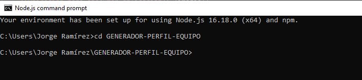
* Ejecuta el comando: "node index.js"  
  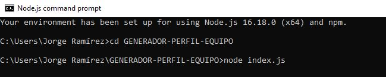

## Información de uso de la aplicación 

* Primero introduce la información completa del gerente respetando el formato de cada dato solicitado. Cada vez que introduzcas un nuevo dato presiona ENTER para poder llenar el siguiente dato.
  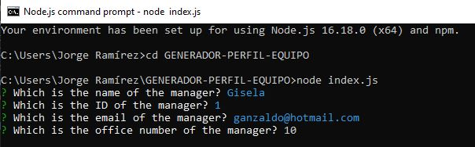
* Cuando termines de llenar la información del gerente, se te presentará un menú de opciones donde puedes elegir si quieres agregar un ingeniero, un pasante o terminar el proceso.
  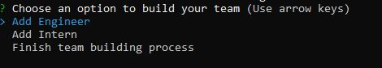
* Selecciona la opción que desees de la lista desplazándote con las flechas del teclado y presionando ENTER.
* Si decidiste agregar un ingeniero o pasante, llena la información de cada uno. Cada vez que introduzcas un nuevo dato presiona ENTER para poder llenar el siguiente dato.
  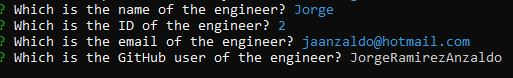      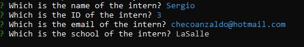
* Al terminar de llenar la información del ingeniero o pasante, se desplegará de nuevo el menú de opciones para agregar otro ingeniero o pasante. De esta manera puedes generar tu equipo completo.
* En cualquier momento que se te presente el menú de opciones y decidas seleccionar la opción de terminar el proceso, se crearán los archivos para la página web HTML con la información introducida. Si el proceso fue exitoso, aparecerán los siguientes mensajes en la terminal:
  * "index.html file successfully created"
  * "style.css file successfully created"  
  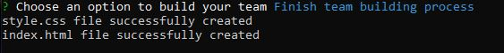
* Los archivos generados pueden ser encontrados en la carpeta dist/, tal como se muestra en la siguiente imagen:  
  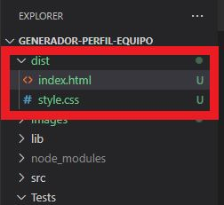

## Información sobre pruebas unitarias

* Para ejecutar las pruebas unitarias:
  * Se tiene que hacer desde la terminal de node.js
  * Hay que asegurarse de estar en la ubicación de la carpeta principal/raíz de la aplicación: GENERADOR-PERFIL-EQUIPO\  
    
  * Ejecutar el comando "npm test" en la línea de comando.  
    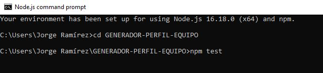

* Las pruebas unitarias se ubican en la carpeta Tests/ y realizan pruebas sobre las clases de los archivos ubicados en la carpeta lib/:

    * El archivo Employee.test.js se encarga de hacer pruebas unitarias sobre la clase Employee del archivo Employee.js:
        * Valida que se cree un empleado con nombre, identificador y correo electrónico.
        * Valida que se regrese el nombre, el identificador, el correo electrónico y el rol del empleado con los métodos adecuados.  
    
    * El archivo Engineer.test.js se encarga de hacer pruebas unitarias sobre la clase Engineer del archivo Engineer.js:
        * Valida que se lancen los correspondientes errores si algún dato (nombre, identificador, correo electrónico o usuario de GitHub) no fue introducido en el formato adecuado.
        * Valida que se cree un ingeniero con nombre, identificador, correo electrónico y usuario de GitHub.
        * Valida que se regrese el nombre, el identificador, el correo electrónico, el rol y el usuario de GitHub del ingeniero con los métodos adecuados.  

    * El archivo Manager.test.js se encarga de hacer pruebas unitarias sobre la clase Manager del archivo Manager.js:
        * Valida que se lancen los correspondientes errores si algún dato (nombre, identificador, correo electrónico o número de oficina) no fue introducido en el formato adecuado.
        * Valida que se cree un gerente con nombre, identificador, correo electrónico y número de oficina.
        * Valida que se regrese el nombre, el identificador, el correo electrónico y el rol del gerente con los métodos adecuados.  

    * El archivo Intern.test.js se encarga de hacer pruebas unitarias sobre la clase Intern del archivo Intern.js:
        * Valida que se lancen los correspondientes errores si algún dato (nombre, identificador, correo electrónico o escuela) no fue introducido en el formato adecuado.
        * Valida que se cree un pasante con nombre, identificador, correo electrónico y escuela.
        * Valida que se regrese el nombre, el identificador, el correo electrónico, el rol y la escuela del pasante con los métodos adecuados. 

* Al ejecutar las pruebas, el resultado debe mostrar 4 Test Suites y 53 Tests con status PASSED.  
  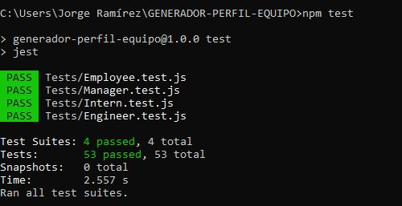
        

## Enlace a video de funcionalidad de la aplicación

* [Link a video](https://drive.google.com/file/d/1WNxs2EjjLXmKEq5to0mNVHpAzl8lAU4i/view)

## Muestra de una página web HTML creada dinámicamente con la información de un equipo

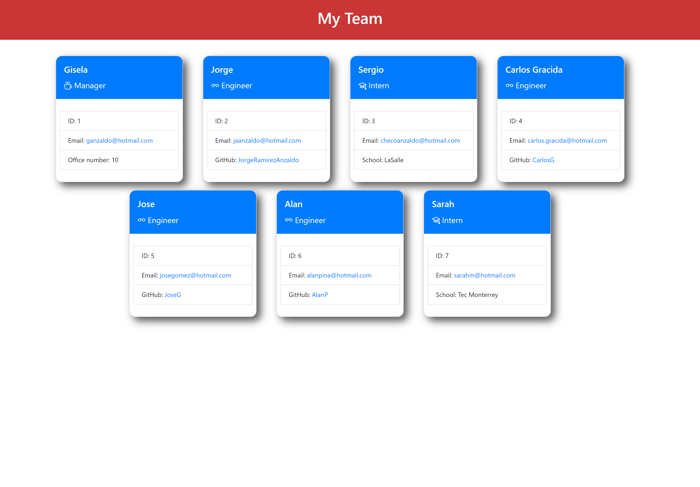

